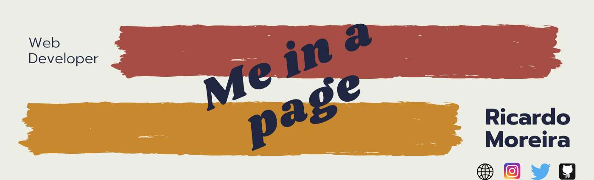
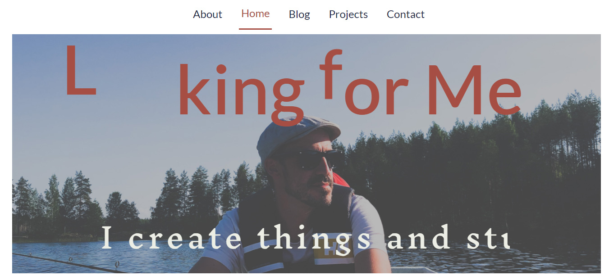
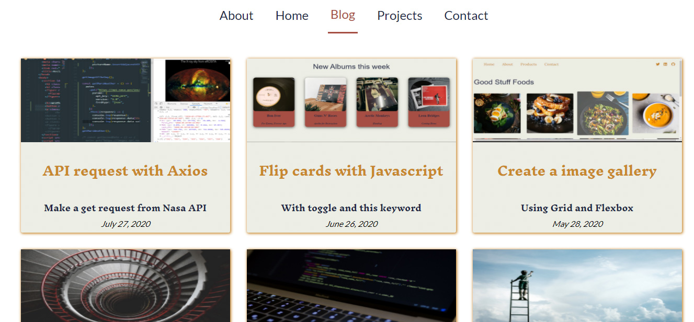

<h1 align="center"> 🔥Ricardo Moreira🔥</h1>

<h2 align="center">My own webpage</h2>

### Index

* [Name](#Name) 👈
* [Links](#Links) 🔗
* [Description](#Description) 📖
* [Languages and Frameworks](####Languages-and-Frameworks) ⚙️
* [Screenshots](#Screenshots) 📱
* [Instalation](#Instalation) 🧩
* [Support](#Support) 🆘
* [Roadmap](#Roadmap) 🗺️
* [Authors and acknowledgment](####Authors-and-acknowledgment) ✍️
* [Project Status](#Project-Status) 📜

# Name

Ricardo Moreira

# Links

[Website](https://www.ricardomoreira.io/)

___

# Description

When I decided to build my website, I was starting to learn [Nuxt](https://nuxtjs.org/) and [NetlifyCMS](https://www.netlifycms.org/) so I decided to give it a go.

Was not easy in the beginning, couldn't find any good documents or templates that would make it work with Nuxt and Netlify. I used [Bael Template](https://github.com/jake-101/bael-template) and [Tyler Template](https://github.com/tylermercer/nuxt-netlifycms-boilerplate) as reference and went from there.

From that, I used also the Nellify forms to create my contact page, add my projects and blog page and other features.

There is still many features to add, bugs to fix and improvements to make. I will update here as long as I go.

The more I will learn, more updates will show up here, among other projects.

Stick around

___

# Languages, Frameworks and others

* **Nuxt.js** - Framework
* **Netlify CMS** - CMS
* **Font Awesome** - Icons

____

# Screenshots

Home Page         |  Blog Page
:-------------------------:|:-------------------------:
  |  

____

# Instalation

___

# Support

Have any question or find something that doesn't look good? Let's talk 😊

[Here](https://github.com/mugas)

[And Here](https://www.ricardomoreira.io/about)

____

# Roadmap

Next steps to me implemented:

1. Improve SEO
1. Improve speed on mobile version
1. Add comments section

____

# Authors-and-acknowledgment

* [Tyler Template](https://github.com/tylermercer/nuxt-netlifycms-boilerplate)

* Me 😊

____

# Project-Status  

Always improving

____
