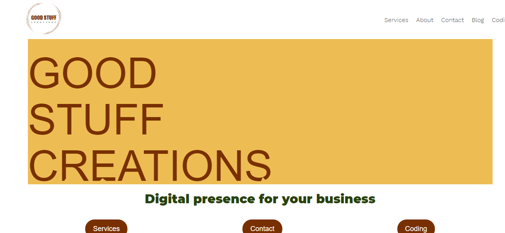
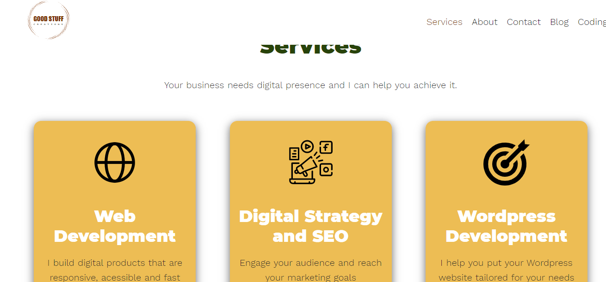

<h1 align="center"> 🔥Good Stuff Creations🔥</h1>

<h2 align="center">More sustainable website and coding</h2>

### Index

- [Name](#Name) 👈
- [Links](#Links) 🔗
- [Description](#Description) 📖
- [Languages and Frameworks](####Languages-and-Frameworks) ⚙️
- [Screenshots](#Screenshots) 📱
- [Instalation](#Instalation) 🧩
- [Support](#Support) 🆘
- [Roadmap](#Roadmap) 🗺️
- [Authors and acknowledgment](####Authors-and-acknowledgment) ✍️
- [Project Status](#Project-Status) 📜

# Name

Good Stuff Creations

# Links

[Website](https://www.gscreations.io/)

---

# Description

I wanted to have a website where I could offer my freelance services but also could share my coding tutorials, snippets, etc. I had my own [website](http://ricardomoreira.io/) but I want that my personal website becomes more than only about coding, hence I create this website.
Also made in Nuxt, but with some improvements. Mostly based on Tom [tutorial](https://code-tribe.com/). Then I add change (and will continue changing it) to become more my own website. With Tom tutorial I could learn more about to create a blog without using Vuex, but stil have a fast and functional website.

---

# Languages, Frameworks and others

- **Nuxt.js** - Framework
- **Netlify CMS** - CMS
- **Font Awesome** - Icons
- **Share This** - Social Media

---

# Screenshots

|             Home Page             |             Blog Page              |
| :-------------------------------: | :--------------------------------: |
|  |  |

---

# Instalation

---

# Support

Have any question or find something that doesn't look good? Let's talk 😊

[Here](https://github.com/mugas)

[And Here](https://www.gscreations.io/about)

---

# Roadmap

Next steps to me implemented:

1. Improve Acessibility

---

# Authors-and-acknowledgment

- [Tom](https://code-tribe.com/)

- Me 😊

---

# Project-Status

Always improving

---
